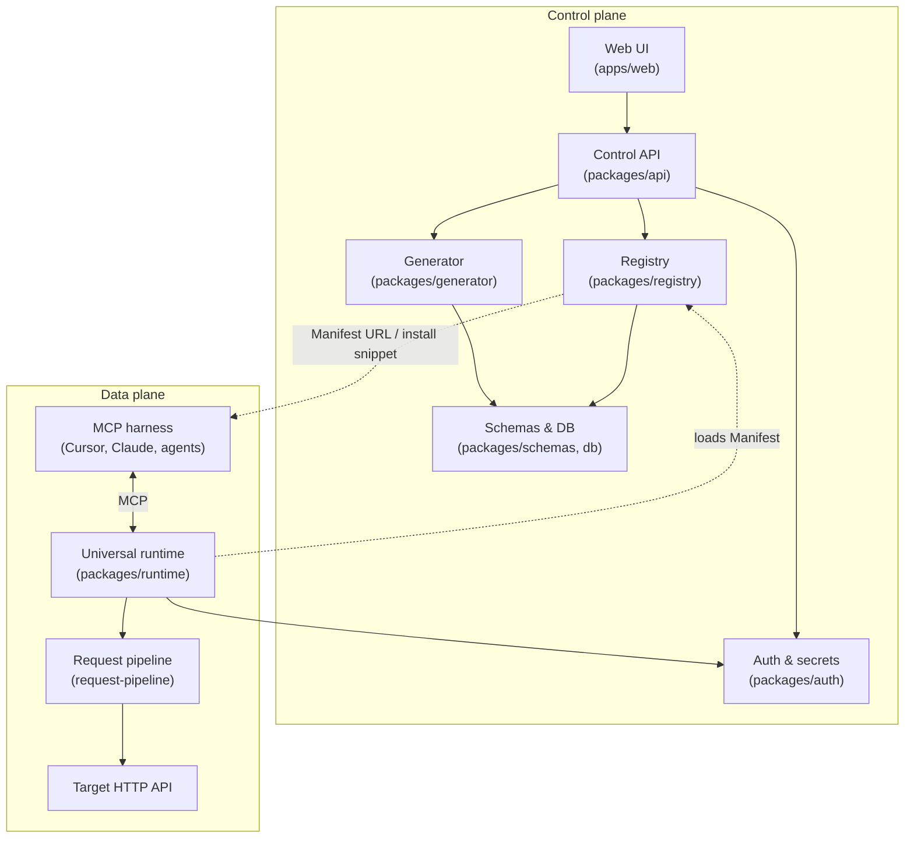

# MCP Definer

[](https://github.com/ChrisHoban/mcp-definer/actions/workflows/ci.yml)
[](https://github.com/ChrisHoban/mcp-definer/actions/workflows/secret-scan.yml)
[](https://codecov.io/gh/ChrisHoban/mcp-definer)
[](https://github.com/ChrisHoban/mcp-definer/security/dependabot)

Turn any HTTP API into a standardized **Model Context Protocol (MCP)** server that AI agents can discover, install, and use—without hand-written integration code.

## What it does

Organizations and developers expose existing APIs to AI tools (Cursor, Claude Desktop, custom agents) through a repeatable pipeline:

1. **Import** an OpenAPI specification and curate which operations become MCP tools.
2. **Generate** a versioned **Manifest**—the declarative contract that describes tools, auth, and transport.
3. **Publish** to a shared registry so harnesses can discover and install MCPs.
4. **Run** a universal runtime that serves any Manifest as a live MCP server and proxies calls to the upstream API.

The result is faster time-to-value for agent integrations, consistent behavior across harnesses, and a single catalog for MCP governance inside an organization.

For vision, glossary, and detailed requirements, see the [manifest documentation](./manifest/README.md).

## Technical overview

| Layer | Technology | Role |
| --- | --- | --- |
| Language & runtime | TypeScript on Node.js 22 | End-to-end type sharing (IR, Manifest, API) |
| Monorepo | pnpm workspaces | `packages/*` libraries + `apps/web` UI |
| Data | PostgreSQL | Registry, versions, discovery views |
| HTTP control plane | Fastify (`packages/api`) | Sole REST entry—authoring, publish, discovery |
| MCP runtime | `@modelcontextprotocol/sdk` | Universal stdio/HTTP MCP server |
| Web UI | React + Vite (`apps/web`) | Create, edit, test, and manage MCPs |
| Testing | Vitest | Unit, contract, integration, and E2E layers |
| CI | GitHub Actions | Lint, build, test, contract-test, integration, e2e |

### Architecture (conceptual)



**Key design choices** (see [Architecture Decisions](./manifest/ARCHITECTURE_DECISIONS.md)):

- **Manifest-driven runtime (ADR-001):** one runtime serves any MCP; optional codegen export later.
- **Registry is a library, API owns HTTP (ADR-011):** no duplicate HTTP surfaces.
- **Secrets never in Manifests (ADR-004):** credential bindings reference vault/env at call time.
- **Shared request pipeline (ADR-012):** runtime and API `:invoke` test console share outbound HTTP + SSRF rules.

### Repository layout

```
mcp-definer/
├── manifest/          # Specs, ADRs, component design docs
├── packages/          # schemas, db, generator, runtime, api, registry, auth, cli, …
├── apps/web/          # Management UI
├── fixtures/          # OpenAPI specs, golden manifests, contract fixtures
├── docker/            # Postgres compose for local dev
├── scripts/           # bootstrap, contract tests
└── tests/e2e/         # End-to-end acceptance
```

## Local development

### Prerequisites

- Node.js 22+
- [pnpm](https://pnpm.io/) 9+
- Docker (for local PostgreSQL)

### Configure

1. Clone the repository and install dependencies:

   ```bash
   pnpm install
   ```

2. Copy environment defaults and adjust if needed:

   ```bash
   copy .env.example .env
   ```

   `DATABASE_URL`, `MCP_DEFINER_API_KEY`, and related settings are documented in [`.env.example`](./.env.example).

3. Start Postgres and apply migrations:

   ```bash
   pnpm bootstrap
   ```

   Or step-by-step: `docker compose -f docker/docker-compose.yml up -d` then `pnpm db:migrate`. See [`packages/db/README.md`](./packages/db/README.md) for connection troubleshooting.

### Run services

```bash
pnpm dev:api    # Control plane API (default :3000)
pnpm dev:web    # Web UI (default :5173)
```

### Build & quality checks

```bash
pnpm lint
pnpm build
pnpm test              # Unit tests (packages)
pnpm test:coverage     # Package unit tests with coverage report
pnpm test:web          # Web UI unit tests
pnpm test:web:coverage # Web UI tests with coverage report
pnpm contract-test     # Cross-package schema & golden fixtures
pnpm test:integration  # API + Postgres integration (requires DATABASE_URL)
pnpm test:e2e          # Full publish → install → runtime loop
```

Integration and E2E tests expect Postgres (same credentials as `.env.example` or CI service container).

## Documentation

| Document | Description |
| --- | --- |
| [manifest/README.md](./manifest/README.md) | How to navigate specs and component folders |
| [manifest/PROJECT_OVERVIEW.md](./manifest/PROJECT_OVERVIEW.md) | Vision, personas, glossary |
| [manifest/REQUIREMENTS.md](./manifest/REQUIREMENTS.md) | System requirements |
| [manifest/ARCHITECTURE_DECISIONS.md](./manifest/ARCHITECTURE_DECISIONS.md) | Binding ADRs |
| [manifest/TESTING.md](./manifest/TESTING.md) | Contract, integration, and E2E strategy |

## Project health metrics

| Metric | Status | Notes |
| --- | --- | --- |
| CI (lint, audit, test, contract, integration, e2e) | [](https://github.com/ChrisHoban/mcp-definer/actions/workflows/ci.yml) | Runs on every push/PR to `main` / `master` |
| Secret scanning | [](https://github.com/ChrisHoban/mcp-definer/actions/workflows/secret-scan.yml) | Gitleaks on push/PR |
| Code coverage | [](https://codecov.io/gh/ChrisHoban/mcp-definer) | Vitest coverage from packages + web; uploaded in CI |
| Dependency vulnerabilities | [](https://github.com/ChrisHoban/mcp-definer/security/dependabot) | Weekly Dependabot PRs; `pnpm audit --audit-level=high` in CI |
